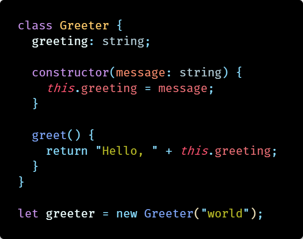
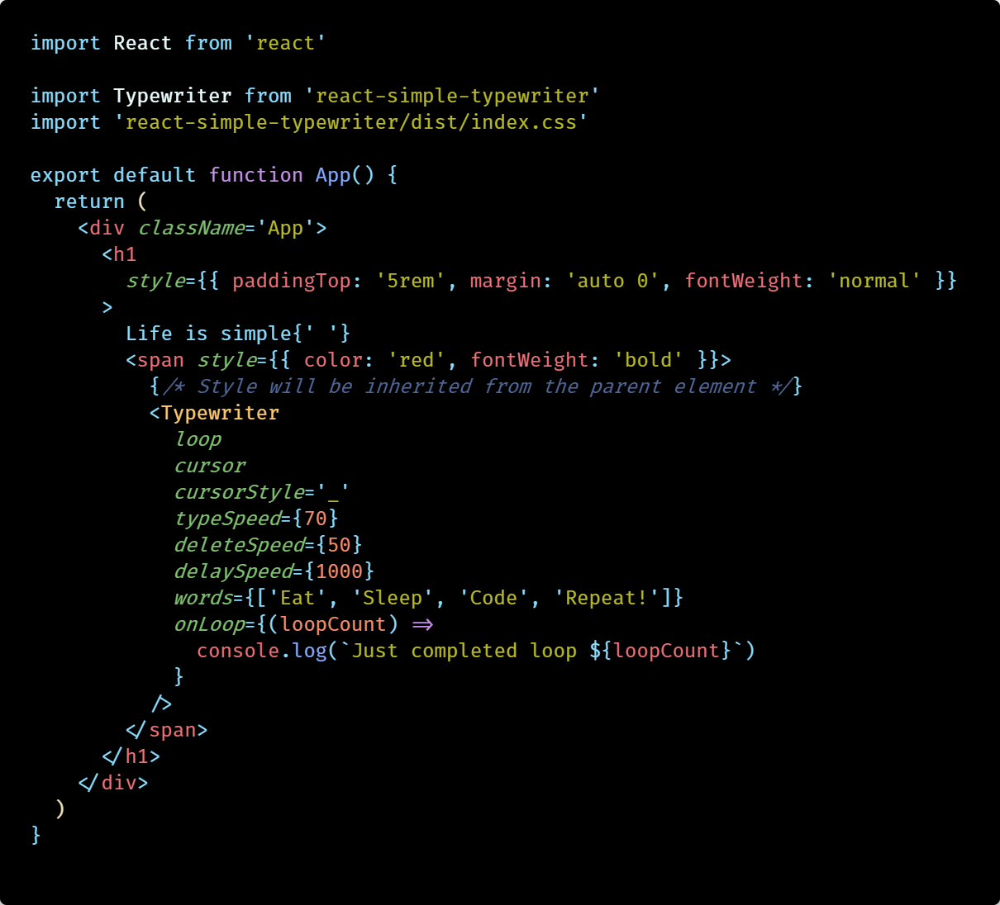
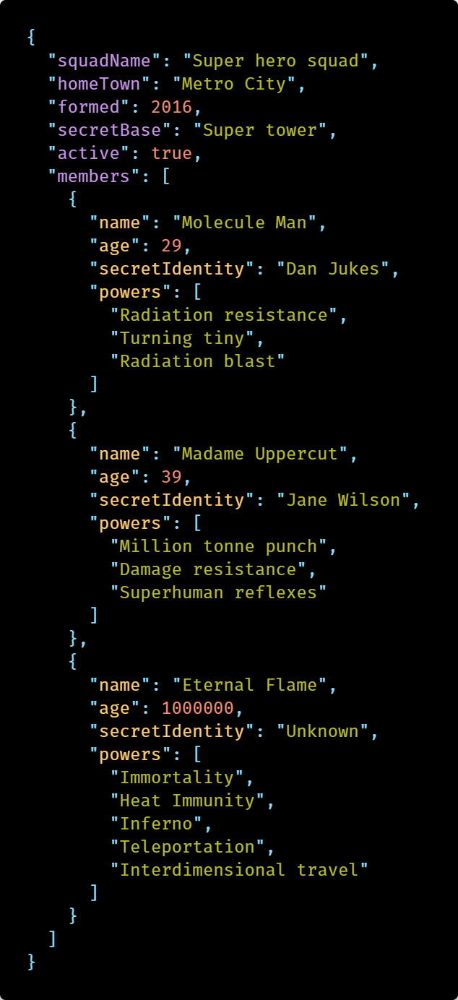
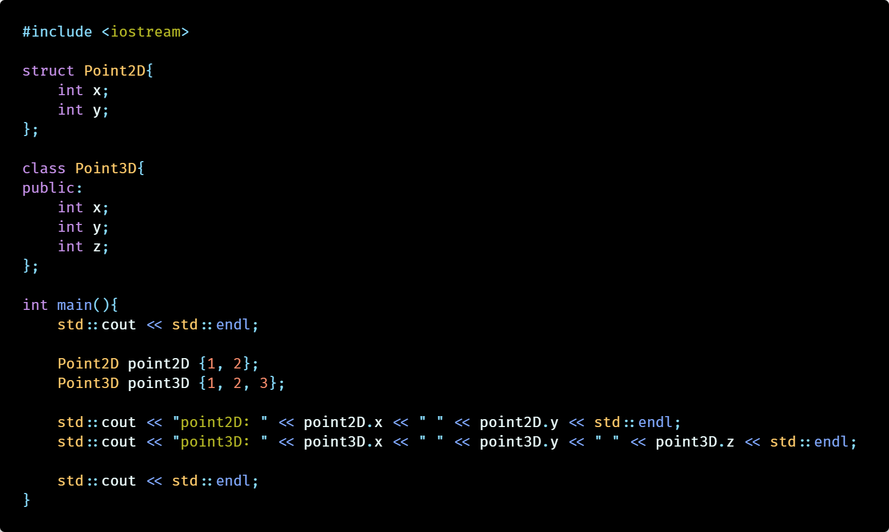
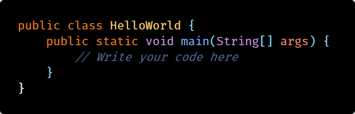
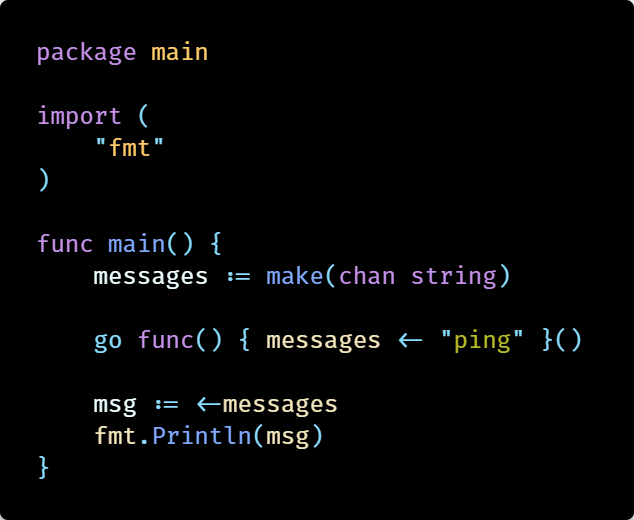
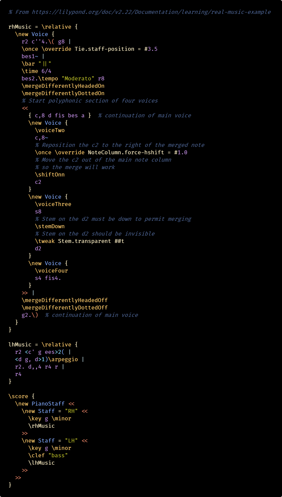

# Noir Theme for Visual Studio Code

[](https://marketplace.visualstudio.com/items?itemName=jeandeaual.noir)
[](https://github.com/jeandeaual/vscode-theme-noir/actions?query=workflow%3Abuild)

Pure black theme for Visual Studio Code.

## Screenshots

### TypeScript



### React



### JSON



### C++



### Java



### Go



### LilyPond



## Requirements

* [Visual Studio Code](https://code.visualstudio.com/) 1.54.0 or newer

## Installation

* [Visual Studio Marketplace](https://marketplace.visualstudio.com/items?itemName=jeandeaual.noir)
* [Open VSX Registry](https://open-vsx.org/extension/jeandeaual/noir)

## Build

```sh
yarn install
npx vsce package
```

## Release Notes

See [here](CHANGELOG.md).
